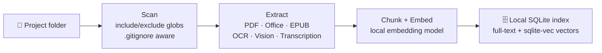
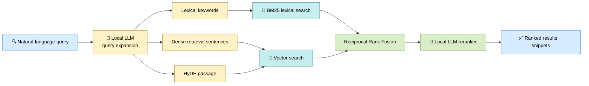

<p align="center">
  
</p>

<h1 align="center">Soma</h1>

<p align="center">
  <b>Local-first semantic search engine for your documents, PDFs, images, audio and video.</b><br>
  Search your own files in plain language — 100% offline, no cloud, no API keys, one single binary.
</p>

<p align="center">
  <a href="https://github.com/AwesomeDog/soma/releases/latest"></a>
  <a href="https://github.com/AwesomeDog/soma/releases"></a>
  
  
  
  <a href="https://github.com/AwesomeDog/soma/stargazers"></a>
</p>

---

**Soma is a local knowledge-base search engine that actually understands your material.**

It indexes documents and multimedia files from folders you choose, stores everything in a local SQLite database, and
uses **locally running AI models** to build a *semantic fingerprint* of every file — the model's understanding of what
is actually inside. You can then search with **natural-language questions** (`"how does auth work"`) or with
**exact keywords and phrases** (`"rate limiter" -redis`), from the **CLI**, a **built-in web UI**, or an **HTTP API**.

Nothing is uploaded. No OpenAI key. No subscription. No background daemon you didn't ask for.

> **Mental model:** add a **project** → run `sync` → `search` finds it.

```bash
soma project add ~/notes     # 1. point Soma at a folder
soma sync                    # 2. index + extract + embed (fully local)
soma search "how does auth work"   # 3. ask in plain language
```

<p align="center">
  
  
</p>

## Table of Contents

- [Why Soma](#why-soma)
- [Features](#features)
- [How It Works](#how-it-works)
- [Supported File Types](#supported-file-types)
- [Installation](#installation)
- [Quick Start](#quick-start)
- [Search Modes](#search-modes)
- [Web UI and HTTP API](#web-ui-and-http-api)
- [Command Cheat Sheet](#command-cheat-sheet)
- [Where Soma Stores Data](#where-soma-stores-data)
- [Offline and Air-Gapped Installs](#offline-and-air-gapped-installs)
- [System Requirements](#system-requirements)
- [Use Cases](#use-cases)
- [Soma vs. Other Search Tools](#soma-vs-other-search-tools)
- [FAQ](#faq)
- [Development](#development)
- [Credits](#credits)

## Why Soma

Traditional desktop search and `grep` / `ripgrep` only find what you can spell. Cloud "AI search" products find what you
mean — but only after you upload your private notes, contracts, research papers and meeting recordings to somebody
else's server.

**Soma gives you semantic search without the cloud.**

- 🔒 **Private by design** — every model runs on your machine; your files never leave the device.
- 🧠 **Understands meaning, not just strings** — local LLM query expansion, dense embeddings, HyDE, and an LLM reranker.
- 🔤 **Still great at exact matching** — BM25 keyword/phrase search with prefix matching and exclusions.
- 📎 **Reads more than text** — PDFs, Office files, EPUBs, screenshots, photos, audio and video become searchable.
- 📦 **One file, zero setup** — a single GraalVM native binary; no Python, no Docker, no vector database service.
- 🤖 **Agent-friendly** — JSON/CSV/Markdown output and a JSON-RPC-style HTTP endpoint for scripts, MCP-style tooling and
  RAG pipelines.

## Features

| | |
|---|---|
| **Hybrid search** | Lexical (BM25) + vector (dense embeddings) + HyDE, fused with Reciprocal Rank Fusion and reranked by a local LLM |
| **Natural-language queries** | `soma search "why do pods restart after deploy"` |
| **Exact lexical search** | Prefix match, `"quoted phrases"`, `-exclusions`, per-project scoping |
| **Multilingual + CJK** | Unicode NFKC normalization, camelCase/snake_case/path tokenization, CJK unigram + bigram indexing so 1–2 character queries still work |
| **Rich file extraction** | PDF text extraction, Office/EPUB → Markdown, OCR, vision-LLM image understanding, audio/video transcription |
| **Local models only** | EmbeddingGemma, Qwen3 reranker, Qwen3-VL, Whisper — all run through `llama.cpp` / `whisperfile` on CPU or GPU |
| **Built-in web UI** | `soma server` gives you a searchable browser interface on `http://localhost:8181` |
| **HTTP API** | `POST /api/run` mirrors the CLI, so agents and scripts get the same contract |
| **Workspaces** | Isolate environments; `soma init` keeps config + index inside `.soma/` so the index travels with the folder |
| **Context hints** | Attach descriptive text to a project path to improve relevance and snippets |
| **Cross-platform native binaries** | Windows x64, macOS ARM64, Linux x64 |
| **Air-gap ready** | Export/import all models and tools as a single ZIP, no network required at runtime |

## How It Works

### Indexing pipeline



### Query pipeline



Every stage — expansion, embedding, retrieval and reranking — runs locally.

## Supported File Types

| Category | Typical formats | How Soma makes it searchable |
|---|---|---|
| **Text & code** | Markdown, TXT, CSV, source files | Indexed directly |
| **PDF** | `.pdf` | Text-layer extraction, OCR for scanned pages |
| **Office & ebooks** | `.docx`, `.xlsx`, `.pptx`, `.epub`, … | Converted to Markdown via Pandoc |
| **Images & screenshots** | `.png`, `.jpg`, `.webp`, … | OCR text + vision-LLM description |
| **Audio & video** | `.mp3`, `.wav`, `.m4a`, `.mp4`, `.mkv`, … | FFmpeg + Whisper transcription |

Multimedia extraction is optional — text-only indexing works on a modest machine.

## Installation

### Package managers

```shell
# Windows
winget install AwesomeDog.soma

# macOS (Homebrew)
brew install AwesomeDog/tap/soma

# Linux (x64)
curl -fsSL https://github.com/AwesomeDog/soma/releases/latest/download/soma-linux-x64 -o soma
chmod +x soma && sudo mv soma /usr/local/bin/
```

### Manual download

Grab the single-file executable for your platform from
[**Releases**](https://github.com/AwesomeDog/soma/releases) — Windows x64, macOS ARM64, Linux x64.

```shell
soma --version
```

## Quick Start

```bash
# 1. Add a project — point Soma at a folder you want to search
soma project add ~/notes

# 2. Make it searchable.
#    The first run downloads the local models and tools, so it takes a while.
#    Re-run whenever files change.
soma sync

# 3a. Search in natural language
soma search "how does auth work"

# 3b. Or search by exact keywords / phrases
soma search lexical '"rate limiter" -redis'

# 4. Read a result — by path or by the DocID shown in results
soma get notes/api.md
soma get @a1b2c3 --line-number
```

Example (output is illustrative):

```text
$ soma search "how does auth work" --limit 3

1. soma://notes/api/authentication.md   @a1b2c3
   Requests are authenticated at the gateway: the JWT is verified, then the
   session is resolved against the user store before routing downstream.

2. soma://notes/runbooks/login-failures.md   @d4e5f6
   ...
```

### Useful next steps

```bash
# Built-in web UI at http://localhost:8181, syncing on start and hourly
soma server --auto-sync

# Directory-local workspace: config + index live in ./.soma/, so the index
# travels with the folder
soma init && soma project add .

# Restrict search scope, get machine-readable output
soma search "deployment checklist" -p docs -f json
soma search lexical "incident response" --full --line-number
```

Full specification and command reference: [**docs/specs/prd.md**](docs/specs/prd.md).

## Search Modes

Soma exposes three retrieval modes so you can trade recall for precision and speed.

### 1. Hybrid search (default) — best relevance

```bash
soma search "how does auth work"
soma s "performance" --intent "web page load times"
soma search hybrid --lex "CAP theorem" --vec "consistency tradeoffs"
```

A local LLM expands your query into lexical keywords, dense retrieval sentences and a HyDE passage; results from all
signals are fused (RRF) and reranked. You can override any expansion channel manually with `--lex`, `--vec`, `--hyde`,
and add background with `--intent`.

### 2. Lexical search — exact keywords, phrases, exclusions

```bash
soma search lexical "CAP theorem consistency"
soma search lexical '"machine learning" -"deep learning"'
soma search lexical "auth -oauth -saml"
```

| Syntax | Meaning | Example |
|---|---|---|
| `word` | Prefix match | `perf` matches `performance` |
| `"phrase"` | Exact phrase | `"rate limiter"` |
| `-word` | Exclude term | `-sports` |
| `-"phrase"` | Exclude phrase | `-"test data"` |

BM25 ranked, no embeddings, no LLM — fast and deterministic.

### 3. Vector search — pure semantic similarity

```bash
soma search vector "what happens when a pod crashes"
soma s v "login failures" --intent "auth troubleshooting"
```

Embeds your query directly and searches by meaning; no expansion, no HyDE, no reranking.

### HyDE input

Write what a *good matching document* would say, and search with that:

```bash
soma search --hyde "The rate limiter uses a sliding window with a 60-second window. Clients exceeding 100 requests per minute receive 429 Too Many Requests."
```

### Output formats

All search and `get` commands support `-f text|json|csv|md|paths` — ideal for piping into scripts, editors or AI agents.

## Web UI and HTTP API

```bash
soma server --auto-sync     # http://localhost:8181
soma server --port 8080
```

| Endpoint | Purpose |
|---|---|
| `GET /` | Single-file built-in web interface: search, projects, status, documents |
| `GET /health` | Health check (`{"status":"UP","uptime":12}`) |
| `GET /assets/{project}/{path}` | Serves a raw file under a project root for the web UI |
| `POST /api/run` | JSON RPC that mirrors a strict subset of the CLI |

```bash
curl -s localhost:8181/api/run \
  -H 'Content-Type: application/json' \
  -d '{"command":"search.hybrid","args":["how does auth work"],"options":{"limit":5,"format":"json"}}'
```

Response envelope:

```json5
{
  "success": true,
  "requestId": "xxx",
  "durationMs": 124,
  "exitCode": 0,
  "data": { },
  "stdout": "",
  "stderr": "",
  "error": null
}
```

Because the HTTP layer mirrors the CLI, **an AI agent that knows `soma --help` already knows the API** — perfect for
local RAG, coding assistants and automation.

## Command Cheat Sheet

```text
soma
├── project                                    # Project management
│   ├── list (ls) [--default-search]           # List configured projects
│   ├── files <path>                           # List project files by prefix
│   ├── add <root>                             # Add project
│   │   ├── --name <name> --include <glob> --exclude <glob>
│   │   └── --no-ignore-files --no-default-search
│   ├── update <names...> [--default-search|--no-default-search]
│   ├── remove <name> | rename <old> <new> | show <name>
│
├── sync                                       # Everyday maintenance: pull → scan → extract → embed → clean
│
├── search (s)                                 # Search entry point
│   ├── [hybrid (h)] [query]                   # Default: lexical + vector + HyDE + rerank
│   │   └── --lex --vec --hyde --intent
│   ├── lexical (l) <query>                    # BM25 keywords, phrases, exclusions
│   ├── vector (v) <query> [--intent]          # Pure semantic search
│   ├── -p/--project <name>  --limit <num>  --no-limit
│   └── --full  --line-number  -f/--format [text|json|csv|md|paths]
│
├── get <targets...>                           # @docid | soma://project/path | project/path | ./file
│   └── --start-line --max-lines --line-number --max-size -f/--format
│
├── server [http] [--port <n>] [--auto-sync]   # Web UI + HTTP API
│
├── context                                    # Descriptive hints that improve relevance
│   └── list (ls) | set <path> <text> | remove <path>   [-p/--project]
│
├── status                                     # Workspace, index and artifact status
├── init                                       # Create directory-local workspace (.soma/)
│
└── system                                     # Diagnostics/maintenance; prefer `sync`
    ├── pull [--refresh] [--export <arc.zip>] [--import <arc.zip>]
    ├── scan | extract | embed [-p <name>] | clean

GLOBAL: -w/--workspace | -v/--verbose [SOMA_VERBOSE=1]
        --no-color [NO_COLOR=1] | -h/--help | -V/--version
WORKSPACE: -w/--workspace > directory-local > SOMA_DEFAULT_WORKSPACE > XDG 'main'
```

## Where Soma Stores Data

Soma **never modifies your source files**. Everything it creates lives outside your content (or inside `.soma/` for
directory-local workspaces), following the XDG base directory spec on all platforms:

| Data | Location |
|---|---|
| Config (YAML) | `$XDG_CONFIG_HOME/soma/<workspace>.yml` |
| Index DB (SQLite) | `$XDG_STATE_HOME/soma/<workspace>.sqlite` |
| Processing cache | `$XDG_STATE_HOME/soma/caches/cache.sqlite` |
| Logs / locks | `$XDG_STATE_HOME/soma/{logs,locks}/` |
| Models & tools | `$XDG_DATA_HOME/soma/` (shared across workspaces) |

The index is fully derived state — if it is ever corrupted, `soma sync` rebuilds it.

## Offline and Air-Gapped Installs

Prepare everything on a connected machine, then move it to an isolated one:

```bash
# On a machine with internet
soma system pull --export soma-artifacts.zip

# On the air-gapped machine (no HTTP performed)
soma system pull --import soma-artifacts.zip
```

The export is reproducible (identical package hashes produce a byte-identical ZIP) and covers every supported platform.

## System Requirements

- **RAM** — 8 GB minimum for text search; **24 GB or more while multimedia features are running** (OCR, vision, transcription).
- **GPU** — optional. Everything runs on CPU; a GPU speeds up embedding, vision and transcription considerably.
- **OS** — Windows x64, macOS (Apple Silicon / ARM64), Linux x64.
- **Disk** — space for the local models downloaded on first `sync`.
- **Network** — only for the first `sync` (model download) or `system pull`; searching is always offline.

## Use Cases

- 🧠 **Personal knowledge base / second brain** — search Obsidian, Logseq, Zettelkasten or plain Markdown vaults by meaning.
- 📚 **Research library** — semantic search across hundreds of PDFs, including scanned papers via OCR.
- 💻 **Codebase and internal docs** — find "where is retry logic handled" without knowing the function name.
- 🎙️ **Meetings, lectures, podcasts** — transcribe once, then search what was actually said.
- 🖼️ **Screenshot and photo archives** — OCR + vision descriptions make images findable.
- 🤖 **Local RAG for AI agents** — a private retrieval backend with JSON output and an HTTP API, no vector DB to operate.
- 🏛️ **Regulated / air-gapped environments** — legal, medical, defense and finance teams that cannot use cloud search.

## Soma vs. Other Search Tools

| | **Soma** | `grep` / `ripgrep` | Spotlight / Windows Search | Cloud AI search |
|---|:--:|:--:|:--:|:--:|
| Natural-language questions | ✅ | ❌ | ❌ | ✅ |
| Exact keyword / phrase (BM25) | ✅ | ✅ (regex) | partial | varies |
| PDF / Office / EPUB content | ✅ | ❌ | partial | ✅ |
| Images (OCR + vision) | ✅ | ❌ | partial | varies |
| Audio / video transcripts | ✅ | ❌ | ❌ | varies |
| Runs fully offline | ✅ | ✅ | ✅ | ❌ |
| Data leaves your machine | never | never | never | yes |
| Scriptable JSON output + HTTP API | ✅ | ✅ | ❌ | ✅ |
| Setup | one binary | one binary | built in | account + upload |

## FAQ

**Does Soma send anything to the cloud?**
No. Indexing and searching are 100% local. The only network access is downloading models and CLI tools on first use
(`soma sync` / `soma system pull`), which you can also do offline via `--export` / `--import`.

**Do I need an OpenAI / Anthropic API key?**
No. Soma bundles a local inference stack (`llama.cpp`, `whisperfile`) and downloads open-weight models.

**Do I need a GPU?**
No. Everything runs on CPU. A GPU mainly accelerates embedding, vision extraction and transcription.

**Does it modify or move my files?**
No. Soma reads your files and writes its index elsewhere. Your folders stay untouched.

**Which languages does it support?**
Indexing and querying are multilingual, with dedicated CJK handling (unigram + bigram indexing) so short Chinese,
Japanese and Korean queries remain retrievable.

**How is this different from `ripgrep`?**
`ripgrep` matches literal strings and regexes in text files. Soma additionally understands *meaning*, and can search
inside PDFs, Office documents, images, audio and video.

**Can I use Soma as a RAG backend for an AI agent?**
Yes — use `-f json` from the CLI or `POST /api/run` over HTTP. The API mirrors the CLI, so there is only one contract
to learn.

**Where does the index live, and can I move it?**
By default under XDG state directories. Run `soma init` in a folder to keep config and index in `./.soma/`, so the
searchable index travels with the directory.

**Something looks stale or broken. What do I run?**
`soma sync` for the normal cycle, `soma system scan` for a full re-read of every file, `soma status` for diagnostics.

## Development

### Toolchain

- **Java 25** with preview features enabled
- **Maven 3.9+**
- **GraalVM 25** with `native-image` on `PATH`
- Internet access on the first build (Maven dependencies + the platform-specific `sqlite-vec` binary bundled at build time)

### Commands

```bash
# Test
mvn test
python3 tests/e2e_tests.py

# Build native executables
mvn -Pnative-windows-x64 -DskipTests clean package   # → target/soma-windows-x64.exe
mvn -Pnative-mac-arm64   -DskipTests clean package   # → target/soma-mac-arm64
mvn -Pnative-linux-x64   -DskipTests clean package   # → target/soma-linux-x64

# Run
./target/soma-mac-arm64 --help

# Older Linux environments may need this because of sqlite-vec
LD_PRELOAD=/usr/lib64/libm.so.6 soma sync

# Release: bump version & trigger CI
v=v0.9.1 && git tag -a "$v" -m "Release $v" && git push origin "$v"
```

Issues and pull requests are welcome — see [docs/specs/prd.md](docs/specs/prd.md) for the canonical behavior spec.

## Credits

Soma bundles [sqlite-vec](https://github.com/asg017/sqlite-vec), Copyright (c) 2024 Alex Garcia, under the
[MIT License](https://github.com/asg017/sqlite-vec/blob/v0.1.9/LICENSE-MIT).

Soma downloads and invokes several external command-line tools locally. Thanks to the maintainers of
[pdfium-helper's `opencc-rs` CLI](https://github.com/laisuk/pdfium-helper),
[FFmpeg](https://ffmpeg.org/) and [Jellyfin FFmpeg](https://github.com/jellyfin/jellyfin-ffmpeg),
[Pandoc](https://pandoc.org/), [llamafile's `whisperfile`](https://github.com/mozilla-ai/llamafile),
[RapidOCR-CLI](https://github.com/AwesomeDog/RapidOCR-CLI), and
[llama.cpp](https://github.com/ggml-org/llama.cpp) for powering PDF extraction, Office/EPUB conversion, media
processing, transcription, OCR, and local model inference.

The local search pipeline relies on model releases and quantizations from
[whisper.cpp](https://huggingface.co/ggerganov/whisper.cpp),
[EmbeddingGemma](https://huggingface.co/ggml-org/embeddinggemma-300M-GGUF),
[QMD Query Expansion](https://huggingface.co/tobil/qmd-query-expansion-1.7B-gguf),
[Qwen3 Reranker](https://huggingface.co/ggml-org/Qwen3-Reranker-0.6B-Q8_0-GGUF),
[Qwen3-4B-Instruct](https://huggingface.co/bartowski/Qwen_Qwen3-4B-Instruct-2507-GGUF), and
[Qwen3-VL](https://huggingface.co/Qwen/Qwen3-VL-4B-Instruct-GGUF). Thanks to their authors, maintainers and publishers
for making private, local-first search possible.

**Soma** was inspired by [**QMD**](https://github.com/tobi/qmd), but is a ground-up new implementation with its own
functionality, engine, CLI and web UI, compiled to cross-platform native binaries via GraalVM. Huge thanks to the QMD
project for sparking the idea!

---

<sub><b>Keywords:</b> local semantic search · offline AI search engine · local knowledge base · private document search ·
hybrid search BM25 + vector · HyDE retrieval · local RAG · embeddings search CLI · sqlite-vec · llama.cpp ·
search PDF Office EPUB locally · OCR image search · audio and video transcript search · self-hosted search engine ·
grep alternative · desktop search · air-gapped search · GraalVM native image</sub>
