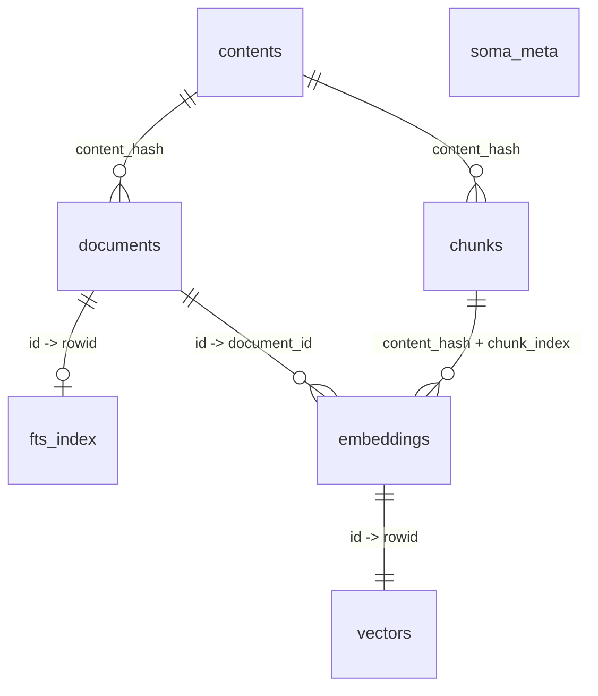

# Soma Data Model

## Design Principles

Soma has one rebuildable index database per workspace and one machine-global processing cache. The [product specification](prd.md) defines public path and identifier semantics.

- YAML is authoritative for projects and context; the databases contain no `projects` or `context` tables.
- Business keys are `(project_name, path)` and `(content_hash, chunk_index)`. Integer IDs align domain rows with FTS/vector virtual-table rowids and survive `VACUUM`.
- DocIDs are not stored; derive them as `'@' || substr(content_hash, 1, 6)`.
- `chunks`, `embeddings`, and `vectors` contain only the active search configuration, not version history.
- Active processing recipes are workspace-global invariants stored once in `soma_meta`, not repeated on derived rows.
- `contents.body` preserves original display text; the app writes projected lexical text to `fts_index`.
- `documents.source_hash` identifies the raw source-file bytes independently of the extracted/indexed body.
- A recipe ID is the 64-character lowercase SHA-256 of an ordered, non-empty list of strings. Encode each string as a four-byte big-endian UTF-8 byte length followed by its UTF-8 bytes, in caller-supplied order. Callers explicitly include the domain, algorithm revision, effective parameters and prompts, and dependency recipe IDs. There is no JSON, map sorting, normalization, or code hashing.

## Schema Definitions

The authoritative DDL, SQLite base-configuration pragmas, and per-object documentation live in the bundled schema files:

- Machine-global processing cache — [`cache-schema.sql`](./cache-schema.sql): `process_cache`, `cache_meta`.
- Workspace index database — [`schema.sql`](./schema.sql): `contents`, `documents`, `chunks`, `embeddings`, `vectors`, `fts_index`, `soma_meta`, and the sync triggers.

## Workspace Index Database

All tables below live in the selected workspace index database.

```text
documents                    ← Document registry (project + path → source hash, content hash, status)
  ├── fts_index              ← Lexical index over app-generated projection text
  ├── contents               ← Deduplicated document bodies
  │     └── chunks           ← Active chunks for vector search and snippets
  │           ↓
  └── embeddings             ← Document-scoped embedding metadata
        └── vectors          ← Vector index (sqlite-vec)

soma_meta                    ← Database metadata key-value store
```



## Recommended Maintenance Strategy

The FTS lifecycle and vector invalidation triggers are defined in [`schema.sql`](./schema.sql). App code writes projected rows explicitly (`title`/`body` are projection strings, `rowid` is `documents.id`):

```sql
DELETE FROM fts_index WHERE rowid = ?;
INSERT INTO fts_index(rowid, title, body) VALUES (?, ?, ?);
```

### Active Recipe State

`soma_meta` stores the active recipe IDs under these keys:

| Key | Materialized output governed by the recipe |
|---|---|
| `active.extraction.pdf_recipe_id` | Searchable bodies of PDF documents |
| `active.extraction.image_recipe_id` | Searchable bodies assembled from image description and OCR |
| `active.extraction.media_recipe_id` | Searchable transcripts of audio and video documents |
| `active.lexical_recipe_id` | Rows in `fts_index` |
| `active.semantic_recipe_id` | Rows in `chunks`, `embeddings`, and `vectors` |

There is no scan recipe. Ordinary sync reuses an indexed `(project_name, path)` without reading it when source mtime and size both match. New or metadata-changed files compare the actual file type, generated title, and decoded text output; a changed rich/media title invalidates that document just like a changed source. Text documents compare their `content_hash` directly. A full scan always reads every included file.

A full scan clears all materialized index rows and all active recipe/rebuild metadata except `database.schema.sha256`, then publishes the active lexical recipe while rebuilding ready documents in batches. This makes its successful result equivalent to scanning into a new workspace index.

Artifact recipe identity is `RecipeId("artifact", "v1", id, version)` for each selected entry in bundled `artifacts.json`; `version` is the output-compatible version shared by all platform entries.

The image extraction recipe combines the image-description recipe, OCR recipe, and body-assembly behavior. Only the final image recipe is workspace state; the two component recipes only key processing-cache entries.

Extraction and lexical recipe changes use invalidate-then-publish ordering: invalidate governed rows in committed batches, publish the new recipe, then incrementally create missing results. Extraction captures its recipe before work and recomputes it before publishing; a mismatch leaves the document pending for retry.

Chunking, document-input formatting, tokenizer, and embedding-model identity form one semantic recipe. A recipe change clears `vectors`, `embeddings`, and `chunks` and publishes the new recipe in one transaction, so readers see either the old semantic index or the new recipe with no semantic rows. The command then rebuilds only its requested project scope; omitted projects remain without vectors until a later `soma sync` or `soma system embed`. Successful embedding batches commit independently, and retries resume from missing chunk, embedding, or vector rows. There is no semantic rebuild-pending flag.

### Extraction Rebuild Rules

Extraction recipes are global per independently invalidated final pipeline, not per document:

- PDF recipe change → set every ready or failed PDF document with a non-null `source_hash` to `pending` and clear its `content_hash`.
- Image recipe change → set every ready or failed image document with a non-null `source_hash` to `pending` and clear its `content_hash`.
- Media recipe change → set every ready or failed audio/video document with a non-null `source_hash` to `pending` and clear its `content_hash`.
- Publish the new global recipe only after all affected documents have been invalidated; then process pending documents incrementally.
- Changing an image-description or OCR component changes the composite image recipe, but does not invalidate PDF or media documents.
- Extraction-recipe invalidation deliberately removes document-scoped embeddings before reprocessing, even if the new extraction later produces the same `content_hash`. The machine-global processing cache may still avoid repeating unchanged component work.

After a recipe is published, a rich/media document is either `ready` under that active recipe or `pending`/`failed` with no searchable body. The workspace does not retain intermediate OCR, vision, or transcription artifacts; reusable intermediate results belong in the processing cache.

### Lexical / Chunk / Vector Rebuild Rules

Keep FTS, chunks, embeddings, and vectors aligned with the active recipes:

- Lexical recipe change → clear `fts_index`, publish the recipe, then rebuild projected rows for ready documents.
- Semantic recipe change → atomically clear `vectors`, `embeddings`, and `chunks`, publish the recipe, then rebuild the requested project scope.
- Document `project_name`/`content_hash`/`extraction_status` change → delete its embeddings; rebuild only when back to `ready`.

### Source Identity Rules

- `documents.source_hash` is the lowercase SHA-256 of the original file bytes. It is null only when the source cannot be read or its type is unsupported.
- `source_hash` and `content_hash` are distinct for rich/media documents: the former identifies the source file, while the latter identifies extracted searchable text.
- Ordinary sync treats matching mtime and size as unchanged without recomputing `source_hash`; content changes that preserve both values require a full scan to discover.
- After inspecting a rich/media source, reuse its existing body only when the scanned and stored `source_hash` values are both non-null and equal and the relevant workspace extraction recipe is current.
- A matching `source_hash` with changed mtime or size updates only source metadata. A changed or missing `source_hash` makes the previous extraction stale and returns the document to processing.
- A failed rich/media document with the same non-null `source_hash` stays failed during an ordinary scan. A source or relevant extraction-recipe change makes it pending again.

### Processing Cache Identity

The machine-global cache retains results from multiple operation recipes across workspaces. Each entry stores an operation-specific `recipe_id` and an `input_hash`, where `input_hash` is the lowercase SHA-256 of the exact source bytes or canonical request bytes. Its key is the raw SHA-256 represented by the recipe ID of the cache-key domain/version, operation, recipe ID, and input hash. Only existing cache consumers use it; this design adds no new cache operations.

### Orphaned Data Cleanup

`documents` are the roots of workspace index state. Normal application writes maintain the other relationships eagerly:

- Document changes and deletions remove stale FTS rows and document-scoped embeddings through schema triggers and foreign-key cascades.
- Embedding writes identify only the document and chunk; persistence derives `embeddings.content_hash` and `vectors.project_name` from that document.
- Deleting embedding metadata removes its vector through the `embeddings_ad` trigger.
- `chunks` belong to `contents` through `ON DELETE CASCADE`.

The only derived roots that can remain after a document changes or disappears are unreferenced `contents`. Cleaning those roots also cascades through their chunks and any remaining downstream embedding/vector rows:

```sql
DELETE FROM contents
WHERE NOT EXISTS (SELECT 1 FROM documents AS d WHERE d.content_hash = contents.content_hash);
```

Cleanup is idempotent and reports the number of directly deleted content roots. It is not a general integrity repair for a database modified outside Soma; rebuild unsupported or corrupt index state with a full scan.

## Search Queries

The app reads the default search scope from config and injects project names into the lexical filter:
```sql
SELECT d.project_name, d.path, bm25(fts_index) AS raw_bm25
FROM fts_index
JOIN documents AS d ON d.id = fts_index.rowid
WHERE fts_index MATCH ? AND d.project_name IN (?, ?)
ORDER BY raw_bm25 ASC;
```
`MATCH` uses the same normalization/tokenization as the projection layer; phrases/exclusions not expressible in FTS5 are verified against `contents.body`. `bm25()` is a raw internal rank (lower = better); Soma converts raw lexical/vector/fused ranks into a public `score` (higher = better within a response).

Vector search must pre-filter on `vectors.project_name`; filtering documents after matching would scope results only after nearest-neighbor evaluation:
```sql
WITH vector_hits AS (
    SELECT rowid AS embedding_id, distance
    FROM vectors
    WHERE embedding MATCH ? AND k = ? AND project_name = ?
)
SELECT d.project_name, d.path, e.content_hash, e.chunk_index,
       c.body AS chunk_body, vector_hits.distance
FROM vector_hits
JOIN embeddings AS e ON e.id = vector_hits.embedding_id
JOIN documents AS d ON d.id = e.document_id
JOIN chunks AS c ON c.content_hash = e.content_hash AND c.chunk_index = e.chunk_index
WHERE d.extraction_status = 'ready'
ORDER BY vector_hits.distance;
```
For multi-project search, run one query per project and merge by distance in memory; for a final size `K`, request `K` per project and keep the global top `K`.
