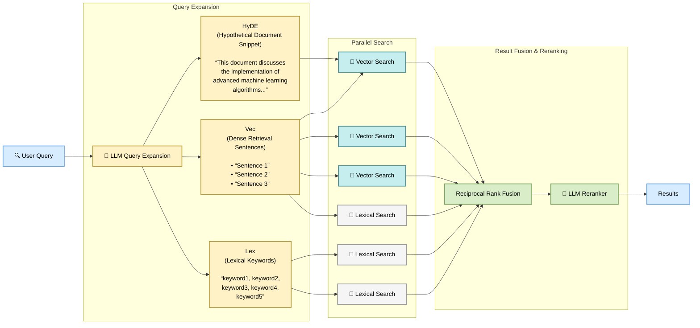

# Soma Specification

Canonical reference; supersedes conflicting content elsewhere.

**Website**: [AwesomeDog/soma](https://github.com/AwesomeDog/soma)

## Quick start

**Mental Model**: add a **project** → `sync` to make everything ready → `search` finds them.

```bash
# 1. Add a project — point soma at a folder you want to search
soma project add ~/notes

# 2. Make it searchable (first run downloads models, may take a while).
#    Re-run whenever files change.
soma sync

# 3. Search in natural language or by exact keywords
soma search "how does auth work"
soma search lexical "authentication"

# Optional: built-in web UI (http://localhost:8181)
soma server --auto-sync

# Optional: soma init — initialize a directory-local workspace to keep config + index in .soma/, so the search data travels with the directory
soma init
soma project add .

# Optional: read file content — by path or by the DocID shown in results
soma get notes/api.md
```

## Cheat Sheet

```text
soma
├── project                                    # Project management
│   ├── list (ls)                              # List configured projects from YAML
│   │   └── --default-search                   # Only projects in default search scope
│   ├── files <path>                           # List project files by prefix
│   ├── add <root>                             # Add project
│   │   ├── --name <name>                      # Name; default path basename
│   │   ├── --include <glob>                   # Files to index; repeatable; default **/*
│   │   ├── --exclude <glob>                   # Files to skip; repeatable
│   │   ├── --no-ignore-files                  # Ignore .gitignore-style files
│   │   └── --no-default-search                # Exclude from default search scope
│   ├── update <names...>                      # Update project(s) attributes
│   │   ├── --default-search                   # Add to default search scope
│   │   └── --no-default-search                # Remove from default search scope
│   ├── remove <name>                          # Remove project
│   ├── rename <old> <new>                     # Rename project
│   └── show <name>                            # Show project details
│
├── sync                                       # Everyday maintenance cycle
│
├── search (s)                                 # Search entry point
│   ├── [hybrid (h)]                           # Default: hybrid search: lexical + vector + HyDE
│   │   ├── [query]                            # Natural-language query; expands to lex, vec, HyDE
│   │   ├── --lex <text>                       # Lexical input; overrides expansion
│   │   ├── --vec <text>                       # Vector input; overrides expansion
│   │   ├── --hyde <text>                      # HyDE input; overrides expansion
│   │   └── --intent <text>                    # Disambiguating background
│   ├── lexical (l) <query>                    # Lexical search: Keywords, phrases, exclusions
│   ├── vector (v) <query>                     # Vector search: Natural-language query
│   │   └── --intent <text>                    # Disambiguating background
│   ├── -p, --project <name>                   # Restrict project; repeatable
│   ├── --limit <num>                          # Max results; default 20
│   ├── --no-limit                             # Return all matches
│   ├── --full                                 # Return full document bodies
│   ├── --line-number                          # Include line numbers
│   └── -f, --format [text|json|csv|md|paths]  # Default text
│
├── get <targets...>                           # Get indexed content: @docid | soma://project/path | project/path | ./file
│   ├── --start-line <line>                    # First line to return
│   ├── --max-lines <num>                      # Max lines per target
│   ├── --line-number                          # Include line numbers
│   ├── --max-size <filesize>                  # Skip larger content; default 10240
│   └── -f, --format [text|json|csv|md|paths]  # Default text
│
├── server                                     # Start Soma service
│   └── [http]                                 # Default HTTP mode
│       ├── --port <n>                         # Default 8181
│       └── --auto-sync                        # Sync on start and hourly
│
├── context                                    # Context management
│   ├── -p, --project <name>                   # Restrict project; repeatable
│   ├── list (ls)                              # List contexts
│   ├── set <path> <text>                      # Set context
│   └── remove <path>                          # Remove context
│
├── status                                     # Workspace, index and managed-artifact status
├── init                                       # Create directory-local workspace
│
└── system                                     # Diagnostics/maintenance; prefer sync
    ├── pull [--refresh]                       # Download/refresh managed artifacts
    │   ├── --export <arc.zip>                 # Export every supported platform
    │   └── --import <arc.zip>                 # Import current platform without network access
    ├── scan                                   # Scan all projects and refresh index database
    ├── extract                                # OCR, vision, transcription
    ├── embed [-p, --project <name>]           # Generate embeddings
    └── clean                                  # Clean orphaned index records

GLOBAL: -w/--workspace | -v/--verbose [SOMA_VERBOSE=1]
        --no-color [NO_COLOR=1] | -h/--help | -V/--version
WORKSPACE: -w/--workspace > directory-local > SOMA_DEFAULT_WORKSPACE > XDG 'main'
```

## Core Concepts

- **Project** — named file set: root + include/exclude globs + search-scope attributes. Name canonicalization: keep Unicode letters/numbers, `_`, `-`; each run of other chars → one `-`; strip leading/trailing `_`/`-`; reject empty result.
- **Document** — one indexed file (`~/docs/api.md` in project `docs` → `soma://docs/api.md`). *Ready* = searchable; *pending*/*failed* = not.
- **Workspace** — selects config and index DB at startup to isolate environments; owns no source files; only management command is `init`. Selection order: `-w` → nearest directory-local workspace upward from CWD → `SOMA_DEFAULT_WORKSPACE` → XDG workspace `main`. Names follow project canonicalization.
- **Chunk** — document section used for embedding and semantic retrieval.
- **Context** — descriptive text attached globally or to project paths; improves relevance and snippets.
- **Default search scope** — projects searched when `-p` is omitted.

### Paths & Identifiers

- Backslashes normalize to `/` on Windows internally for cross-platform consistency.
- **Virtual Path**: `soma://{project}/{path}` — root-relative, `/`-separated, no leading slash. `{project}/{path}` is an input-only abbreviation. Matching is exact and case-sensitive after separator normalization. Virtual Paths identify files; project-wide operations use the project name.
- **DocID**: short stable content-derived ID such as `@a1b2c3`. Identical content or collisions may share one; use full Virtual Path to disambiguate.

### Storage (XDG on all platforms)

| Data | Location |
|---|---|
| Config (YAML) | `$XDG_CONFIG_HOME/soma/<workspace>.yml` |
| Index DB (SQLite) | `$XDG_STATE_HOME/soma/<workspace>.sqlite` |
| Processing cache (SQLite) | `$XDG_STATE_HOME/soma/caches/cache.sqlite` (shared by all workspaces) |
| Logs / Locks | `$XDG_STATE_HOME/soma/{logs,locks}/<workspace>.{log,lock}`; directory-local: `local-<sha256(abs-root)[0:16]>.*` |
| Runtimes/tools | `$XDG_DATA_HOME/soma/` (shared across workspaces) |

- Directory-local workspace is identified by `.soma/local.yml`; `.soma/local.sqlite` created lazily. Every project root must be the workspace root or one of its descendants and is stored as `.` or `./...` with `/` separators. Absolute, `~`-prefixed, or escaping roots make `local.yml` invalid. `.soma` without `local.yml` is ignored; unreadable/invalid `local.yml` → `CONFIG_ERROR`, no fallback.
- Workspace index is rebuildable derived state; recreate corrupt/incompatible state via `soma sync`.
- Optional processing cache is created lazily and recreated when corrupt/incompatible. Workspace lifecycle and maintenance commands never manage it.
- YAML is authoritative for `projects` and `context`. Writes are atomic. Unrecoverable parse errors trigger a timestamped backup before replacement; servers re-read external edits before each command.

### Distribution & Managed Artifacts

- Platforms: Windows x64, Linux x64, macOS ARM64; Native Image executables.
- Managed artifacts are shared across workspaces. Immutable packages stored by full manifest SHA-256 under `$XDG_DATA_HOME/soma/packages`; current derived tree under `live/<id>/<sha6>`. If a requested main entry is missing, artifact-backed commands run the complete refresh flow. No partial provisioning, fallback runtimes, or silent failures.

### Errors & Streams

- `AppError { code, message, remediation, details }`; codes: `INVALID_REQUEST`, `CONFIG_ERROR`, `NOT_FOUND`, `WRITE_LOCKED`, `OPERATION_FAILED`, `INTERNAL_ERROR`.
- Results → `stdout`; progress/warnings/traces → `stderr`. User-facing errors preserve underlying exception messages; `--verbose` additionally writes the CLI stack trace to `stderr`.

## CLI Reference

Management plane and human search interface; binary name `soma`. Options apply **ONLY** to the commands that list them.

### Global options

| Option | Environment | Description |
|--------|-------------|-------------|
| `-w, --workspace <name>` | `SOMA_DEFAULT_WORKSPACE` (fallback after directory-local) | Select workspace. |
| `-v, --verbose` | `SOMA_VERBOSE=1` | Debug logs. |
| `--no-color` | `NO_COLOR=1` | Disable ANSI color. |
| `-h, --help` | | Help. |
| `-V, --version` | | Version. |

### Project management

`add`, `update`, `remove`, `rename` atomically write the workspace config, then incrementally scan all projects. Config stays authoritative; if write succeeds but scanning fails, the change persists in YAML and Soma returns an error with remediation (`soma sync`).

#### `soma project list`

List configured projects and attributes directly from YAML. Use `soma project show <name>` for index statistics. Alias: `soma project ls`.

Options:

- `--default-search`: Only projects in the default search scope.

```bash
soma project list
soma project ls --default-search
```

#### `soma project files <path>`

List files in **ONE** project by prefix. `<path>` type is inferred:

1. **Project name**: `notes` — all files.
2. **Virtual Path prefix**: `soma://notes/src`.
3. **Abbreviated prefix**: `notes/src` — only when first segment is an existing project name.
4. **Filesystem path**: expands `~`, resolves relative from CWD, matches first configured project whose root contains it.

Options: none.

Notes: exact matching (no case folding) after separator normalization. `soma://{project}[/]` accepted as project-root prefix; `get` requires a file path. Prefix matches the exact file and descendants; characters are literal. Parsed Virtual Paths never fall back to another matching mode.

```bash
soma project files notes
soma project files notes/src
soma project files soma://notes/src
soma project files ~/workspace/my-project
```

#### `soma project add <root>`

Add a project rooted at `<root>` and index matching files.

Options:

- `--name <name>`: Name; default directory basename.
- `--include <glob>`: Files to index; default `**/*`.
- `--exclude <glob>`: Files to skip; none by default.
- `--no-ignore-files`: Do not respect ignore files such as `.gitignore`.
- `--no-default-search`: Exclude from default search scope (included by default).

Notes:

- Names canonicalized before uniqueness checks. Roots expand `~`, normalize to absolute paths; `project add` stores the resolved absolute path.
- Globs are root-relative. Filter order: ignore files → `--include` → `--exclude`; only `--no-ignore-files` bypasses ignore files. Include lists cannot be empty; `**/*.md` matches root-level files.
- VCS directories always skipped; common generated directories may be skipped. Scans use stable normalized path order and do not follow directory symlinks; file symlinks may use resolved content.
- Unreadable root fails. Unreadable file is recorded as failed when possible, else warned and skipped. Empty text is valid; rich files start pending; unsupported binaries fail.

```bash
soma project add .
soma project add ~/wiki --name wiki --include "**/*.{md,txt}"
soma project add ~/src --name source --include "**/*" --exclude "node_modules/**" --no-ignore-files
soma project add ~/private --no-default-search
```

#### `soma project update <names...>`

Update attributes for one or more projects.

Options:

- `--default-search`: Add to default search scope.
- `--no-default-search`: Remove from default search scope.

```bash
soma project update docs --default-search
soma project update archive legacy --no-default-search
```

#### `soma project remove <name>`

Remove a project and related project context.

Options: none.

```bash
soma project remove archive
```

#### `soma project rename <old> <new>`

Rename a project and update related project context.

Options: none.

```bash
soma project rename docs product-docs
```

#### `soma project show <name>`

Show project details: root, globs, index stats, default-search membership.

Options: none.

```bash
soma project show docs
```

### Sync

#### `soma sync`

Run one foreground maintenance cycle (`pull → scan → extract → embed → clean`), then exit. Workspace-writing phases coordinate through the shared write lock. `clean` only removes orphaned index records; `sync` performs no cache maintenance. The scan phase reuses indexed paths with unchanged mtime and size without reading or hashing; metadata-preserving content changes stay stale until `soma system scan`.

Options: none.

```bash
soma sync
```

### Search

Aliases: `soma search`, `soma s`.

Common options (all search subcommands):

- `-p, --project <name>`: Restrict project; repeatable; default search scope if omitted.
- `--limit <num>`: Max results; default `20`. Mutually exclusive with `--no-limit`.
- `--no-limit`: Return all matches.
- `--full`: Full document bodies instead of snippets.
- `--line-number`: Include line numbers.
- `-f, --format [text|json|csv|md|paths]`: Output format; default `text`.

Output formats:

- `text` (terminal, default) | `json` | `csv` | `md` | `paths` (path-only).
- `paths` is mutually exclusive with `--full` and `--line-number`.

#### `soma search [hybrid] [query]`

Hybrid search: query expansion, lexical + vector + HyDE retrieval, rank fusion, reranking.

Aliases: `soma search h`, `soma s [hybrid|h]`. `hybrid` is the default subcommand; pass it explicitly if the query text collides with a subcommand name.

Input forms:

- Positional `[query]` enables query expansion to `lex`, `vec`, `hyde`.
- `--lex` / `--vec` / `--hyde` supply explicit inputs, each overriding its expanded value; usable with or without `[query]`.
- `--intent <text>` adds disambiguating background.

Options: common options, plus:

- `--lex <text>`: Lexical input.
- `--vec <text>`: Vector input.
- `--hyde <text>`: HyDE input.
- `--intent <text>`: Disambiguation intent.

Notes:

- Progress/traces → `stderr`; results → `stdout`, keeping `--format` parseable. `--verbose` adds retrieval score traces.
- No degraded mode: expansion, embedding, lexical/vector retrieval, and reranking must all complete, else `OPERATION_FAILED`.
- Vector/HyDE retrieval require ≥1 vector row in scope; none → `OPERATION_FAILED` with remediation `soma sync`. Partial coverage is searched as-is, without a preflight check.
- Manual inputs can reduce or skip expansion but do not enable partial fallback.

```bash
soma search "how does auth work"
soma s "performance" --intent "web page load times"
soma search hybrid --lex "CAP theorem" --vec "consistency tradeoffs"
soma search h --hyde "The rate limiter uses a token bucket and returns 429 after bursts exceed the quota."
soma search hybrid lexical
```

#### `soma search lexical <query>`

Lexical search: keywords, phrases, exclusions; no embeddings or HyDE. See [Lexical query syntax](#lexical-query-syntax).

Aliases: `soma search l`, `soma s lexical`, `soma s l`.

Options: common options only.

```bash
soma search lexical "deployment guide"
soma s l '"rate limiter" -redis' -p docs --limit 10
soma search lexical "incident response" --full --line-number
```

#### `soma search vector <query>`

Vector search: embeds `<query>` directly and searches by meaning; no lexical search, expansion, HyDE, or reranking.

Aliases: `soma search v`, `soma s vector`, `soma s v`.

Options: common options, plus:

- `--intent <text>`: Disambiguation; may affect embedding input formatting and snippet selection, not an extra retrieval input.

Notes:

- Requires ≥1 vector row in scope; none → `OPERATION_FAILED` with remediation `soma sync`. Partial coverage is searched as-is.

```bash
soma search vector "what happens when a pod crashes"
soma s v "login failures" --intent "auth troubleshooting"
```

### Get

#### `soma get <targets...>`

Resolve targets and return indexed document content. Space-separated targets may be mixed; each resolves by priority:

1. **DocID**: `@a1b2c3`.
2. **Virtual Path**: `soma://project/path`, or `project/path` when first segment is a project name. Virtual Path globs (`soma://project/docs/*.md`) resolved by Soma.
3. **Filesystem path**: `./api.md`, `/workspace/docs/api.md`; must map to an indexed project document. Globs use shell expansion.

Options:

- `--start-line <line>`: First line to return (all targets).
- `--max-lines <num>`: Max lines per target.
- `--line-number`: Include line numbers.
- `--max-size <filesize>`: Skip larger document content; default `10240` bytes. Bare number is bytes; suffixes `B`, `KB`, `KiB`, `MB`, `MiB`, `GB`, `GiB` supported, case-insensitive.
- `-f, --format [text|json|csv|md|paths]`: Output format; default `text`.

Notes:

- Oversized indexed bodies are skipped, not fatal.
- `paths` returns resolved Virtual Paths only, does not apply `--max-size`, and is mutually exclusive with `--start-line`, `--max-lines`, `--line-number`.
- Targets resolve independently; per-target misses and ambiguous DocIDs don't suppress other output — diagnostics → `stderr`, partial success exits `3`. Ambiguous DocID diagnostics suggest full Virtual Paths.
- Request-level and infrastructure errors still abort with `AppError`.
- Filesystem targets resolve only through the index. Unindexed files fail and are never read directly.

```bash
soma get docs/api.md
soma get soma://docs/api.md --start-line 120 --max-lines 40
soma get @a1b2c3 @d4e5f6 --line-number
soma get docs/api.md ./indexed-note.md -f md
```

### Server

#### `soma server [http]`

Start the service in HTTP mode (default).

Options:

- `--port <n>`: HTTP port; default `8181`.
- `--auto-sync`: Sync on start, then hourly; busy locks skipped, failures logged, overlapping runs not queued.

```bash
soma server
soma server --port 8080
soma server http --auto-sync
```

#### HTTP Interface

```http
GET /                         # Single-file built-in web interface (search, projects, status, documents);
                              # calls the RPC endpoint — no second command contract
GET /health                   # Health check
GET /assets/{project}/{path}  # Serves a raw binary file under a project root for the built-in web interface
```

Health response:

```json5
{ "status": "UP", "uptime": 12 }  // uptime: server process uptime in seconds
```

#### HTTP RPC Interface

**Mirrors a strict subset of the CLI and evolves in lockstep with it.** All non-lifecycle CLI operations go through one endpoint:

```http
POST /api/run
Content-Type: application/json
```

##### Request Schema

```json5
{
  "command": "search.hybrid",
  "args": ["query string"],
  "options": { "limit": 10, "format": "json" },
  "global": {"verbose": false, "no-color": true }
}
```

##### Mapping Rules

- Accepts `project.*`, `search.*`, `get`, `context.*`, `status`. Rejects unknown commands/globals, and `global.workspace`. Hierarchical commands join with dots (`project list` → `project.list`).
- `args` preserves positional order. `options` maps flags: arrays for repeated flags, `true` for booleans, keep `no-*` prefixes.
- HTTP defaults: `verbose=false`, `no-color=true`.

##### Response Envelope

```json5
{
  "success": true,
  "requestId": "xxx",
  "durationMs": 124,
  "exitCode": 0,
  "data": { },       // structured results
  "stdout": "xxx",   // compatibility/debug
  "stderr": "",
  "error": null
}
```

### Context

Context is descriptive text attached globally (no `-p`) or to project paths (`-p`, repeatable). Identity is `(project, path)`; paths start with `/`, use `/`, and never end with `/` except root `/`. `set` overwrites the matching entry per scoped project; removing missing context is a no-op.

Effective context for a document: global matching prefixes first, then the document's project's matching prefixes; within each group, shorter prefixes first. Texts join with a blank line; `/` matches every document.

#### `soma context list`

List contexts. Alias: `soma context ls`.

Options:

- `-p, --project <name>`: Restrict to project(s); repeatable.

```bash
soma context list
soma context -p docs list
```

#### `soma context set <path> <text>`

Add or overwrite context for `<path>` (a scope like `/`, `/api`, `/docs/rules`).

Options:

- `-p, --project <name>`: Target project(s); repeatable.

```bash
soma context set / "Engineering knowledge base"
soma context -p docs set /api "API documentation and endpoint behavior"
soma context -p docs -p runbooks set /alerts "Operational alert response notes"
```

#### `soma context remove <path>`

Remove context from a path.

Options:

- `-p, --project <name>`: Target project(s); repeatable.

```bash
soma context remove /
soma context -p docs remove /api
```

### Status

#### `soma status`

Show system status: workspace source and paths, project and index stats, health warnings, and managed-artifact info.

Options: none.

```bash
soma status
```

### Init

#### `soma init`

- Creates a directory-local workspace at `.soma/local.yml`.
- Does not add or scan projects, or create the index DB; run `soma project add .` next. The DB remains lazy and is created by the first index operation.
- Projects must stay inside the workspace. Roots use portable `/`-separated relative paths so they remain valid when the directory moves between supported operating systems.
- Rejected in the home directory. An existing valid `.soma/local.yml` succeeds without changing it; an invalid one → `CONFIG_ERROR`.

Options: none.

```bash
soma init
```

### System

Diagnostics/maintenance under `soma system`; prefer `sync` for daily use.

#### `soma system pull`

Download managed artifacts (runs automatically when missing), or export/import an archive.

Options:

- `--refresh`: Re-verify and re-download missing or invalid instead of trusting cached copies.
- `--export <arc.zip>`: Export all platforms + shared packages to a ZIP.
- `--import <arc.zip>`: Import current-platform + shared packages offline.

`--export` and `--import` are mutually exclusive; `--refresh` cannot combine with either archive option.

Behavior:

- **Ordinary pull**: no-op when all current-platform and shared main entries exist as regular files.
- **`--refresh` / missing-entry**: verify packages, download missing/invalid, atomically rebuild live tree (discards prior live contents, including user additions).
- **`--export`**: verify packages for all platforms, download missing/invalid packages as needed, then write `packages/<sha256>` ZIP entries; identical package SHA-256 values produce a byte-identical ZIP; never changes live.
- **`--import`**: verify and rebuild packages; ignore unrelated ZIP entries; no HTTP. Missing/duplicate/invalid packages reported with remediation `soma system pull`; live rebuilt only if all imported.

No artifact lock; concurrent calls may race, but package/live publication is atomic.

```bash
soma system pull
soma system pull --refresh
soma system pull --export arc.zip
soma system pull --import arc.zip
```

#### `soma system scan`

Scan every included file in every project and refresh the index database. Unlike the incremental scan in `soma sync`, this full scan always reads every included file. The final result must equal a from-scratch rebuild from current config and source files.

Commits in batches; no whole-operation atomic visibility. Concurrent readers may observe completed batches while running; after successful completion the final state equals a from-scratch rebuild.

Options: none.

```bash
soma system scan
```

#### `soma system extract`

Run content extraction: PDF text extraction, OCR, vision LLM extraction, transcription. Options: none.

```bash
soma system extract
```

#### `soma system embed`

Generate or refresh embeddings.

Options:

- `-p, --project <name>`: Restrict to project(s); repeatable; default: all projects.

```bash
soma system embed
soma system embed -p docs
```

#### `soma system clean`

Clean orphaned index records. Does not inspect or modify the machine-global processing cache. Options: none.

```bash
soma system clean
```

## Search Query Guide

Three search modes; multilingual indexing and querying.



### Hybrid input

Hybrid search takes a positional query, manual inputs (`--lex`, `--vec`, `--hyde`), or both. `--intent` adds background but never searches by itself.

| Input form | Expansion | Lexical | Vector | HyDE |
|------------|-----------|---------|--------|------|
| Positional query only | yes | expanded | expanded | expanded |
| Positional query + one or two manual inputs | yes | manual when present, else expanded | manual when present, else expanded | manual when present, else expanded |
| Positional query + all three manual inputs | no | manual | manual | manual |
| Manual inputs without positional query | no | manual when present | manual when present | manual when present |

When present, the positional query may also be used directly as additional lexical/vector retrieval signals, with fusion weights that may differ from expanded or manual signals.

A hybrid request with no positional query and no manual input is invalid.

### Lexical query syntax

| Syntax | Meaning | Example |
|--------|---------|---------|
| `word` | Prefix match | `perf` matches `performance` |
| `"phrase"` | Exact phrase | `"rate limiter"` |
| `-word` | Exclude term | `-sports` |
| `-"phrase"` | Exclude phrase | `-"test data"` |

```bash
soma search lexical "CAP theorem consistency"
soma search lexical '"machine learning" -"deep learning"'
soma search lexical "auth -oauth -saml"
```

Lexical matching normalizes with Unicode NFKC and tokenizes Latin text, numbers, paths, and code identifiers (camelCase, snake_case, kebab-case, dotted, slash-separated). CJK runs keep unigrams and bigrams (trigrams for longer runs), so 1–2 character searches stay retrievable. Snippets and highlights come from original document text, not normalized index text.

### Vector query input

Natural-language questions or descriptions, searched by meaning. Query is embedded directly — no query expansion. `--intent` can disambiguate embedding input and snippet selection.

### HyDE input

A hypothetical document passage: write what a good matching document might say.

```bash
soma search --hyde "The rate limiter uses a sliding window algorithm with a 60-second window. When a client exceeds 100 requests per minute, later requests return 429 Too Many Requests."
```

### Intent

Optional background for ambiguous queries (`performance`, `cache`, `security`, `state`); steers expansion, vector search, and snippet selection.

## Glossary

### Search & Querying

- **Search** — Finding relevant documents through hybrid, lexical, or vector retrieval.
- **Candidate retrieval** — Producing candidate documents inside search through lexical or vector matching.
- **Get** — Resolving exact document targets and reading their indexed content.
- **Query** — Search input: natural language, lexical keywords, vector-oriented text, or a HyDE passage.
- **Hybrid search** — Retrieval combining lexical, vector, and HyDE signals.
- **Lexical search** — BM25-ranked keyword and phrase search.
- **Vector search** — Semantic search by embeddings.
- **BM25** — Ranking method used by lexical search.
- **HyDE** — Hypothetical document embedding; input is a passage a relevant document might contain.
- **Query expansion** — Converts a natural-language query into hybrid retrieval inputs.
- **Intent** — Background that disambiguates a query; not a retrieval input.
- **Score** — Relevance estimate; higher is better within one response.

### Indexing & Maintenance

- **Sync** — Full maintenance: pull artifacts, scan projects, extract media text, embed chunks, clean derived state.
- **Scan** — Inspect project files and refresh the workspace index.
- **Extract** — Deriving searchable text from rich/media files via OCR, vision extraction, or transcription.
- **Embedding** — Numeric text representation used for semantic search.
- **Vector index** — Index storage for embeddings.
- **Pull** — Downloading or refreshing managed artifacts.
- **Clean** — Removing orphaned index records; does not maintain the processing cache.
